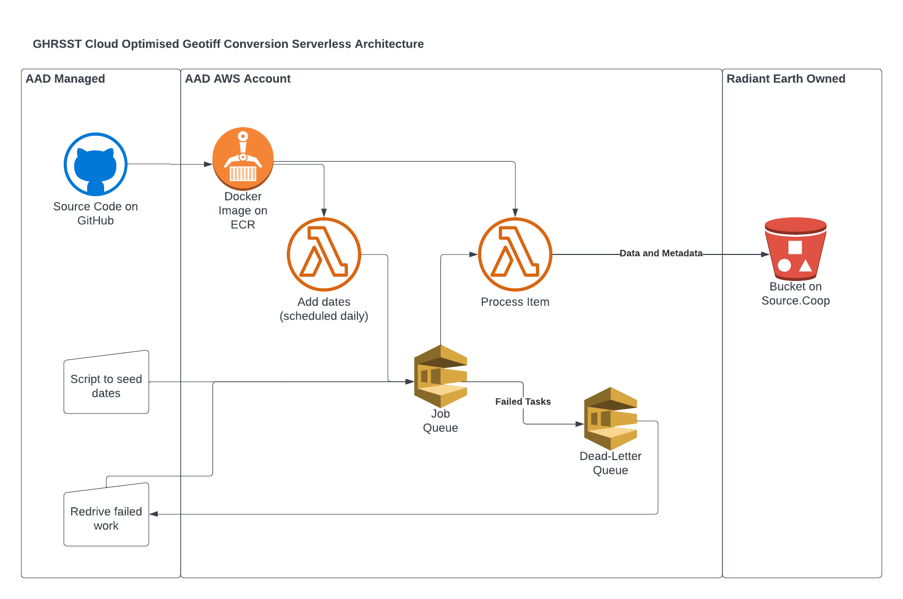

# GHRSST Cogger and Lambda Function

## Overview

The architecture for this process has the following components:

* The code in this respository, including the [cog creation](ghrsst_cogger.py)
  and [date seeding](ghrsst_dategen.py) for the SQS queue
* A Docker image, with a [Dockerfile](Dockerfile)
* Terraform infrastructure as code, which includes:
  * An SQS queue to hold tasks
  * An SQS dead-letter queue to handle failed tasks
  * A Lambda that runs the work that arrives on the queue
  * A Lambda and CloudWatch scheduling that runs every day to seed tasks
    for the last seven days, ensuring that data stays up to date. Note that
    any work that's already been done is skipped.

.

## Cost calculation

Lambda costs `0.0000133334` per GB second. We're running with `10 GB` of memory. Each
job takes around 5 minutes, and there's around 10,000 jobs. So we have a total cost
of `10000 * 0.0000133334 * 10 * 5 * 60` which is `$400` USD. Running each day to convert
the latest data costs almost nothing.

## Infra deployment

Create a secret on AWS for the Earthdata variable.

```bash
aws secretsmanager create-secret \
    --name earthdata-token \
    --secret-string longsecretgoeshere \
    --region us-west-2
```

Initialise first with `terraform init`, then `terraform plan` to see what will
change, and then when happy run `terraform apply`.

## Notes on GitHub Actions

This should have a Terraform process to create the ECR and use OIDC for auth
for pushing the image from Actions to AWS. (Or the equivalent in Bitbucket.)
